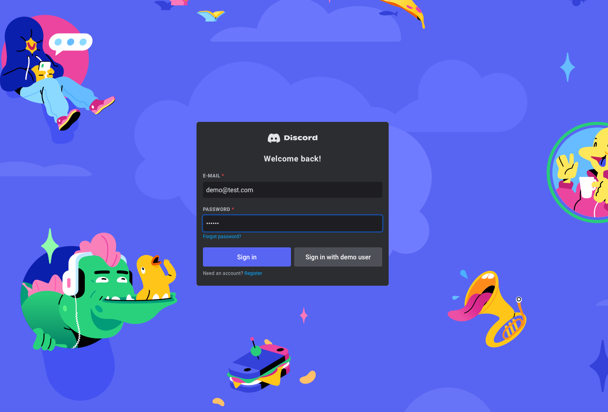

# Discord Clone

<p align="center">
  
  <a href="https://github.com/insomniac2305/discord-clone/graphs/commit-activity" target="_blank"></a>
  
  <a href="https://github.com/insomniac2305/discord-clone/blob/main/LICENSE" target="_blank"></a>
</p>

## Overview

This project is a simple clone of Discord built with React and TailwindCSS that allows users to create and join servers and chat with each other in real-time.

It was created as part of [The Odin Project's curriculum](https://www.theodinproject.com/) to practice creating a single page application with React, that connected to a BaaS provider (Firebase). Later the app was converted to use an Express server as the backend to form a full-stack application. The backend code can be found here: [Discord Clone API](https://github.com/insomniac2305/discord-clone-api).

<p align="center">
  
</p>

<details>
  <summary>Login screenshot</summary>
  <p align="center">
    
  </p>
</details>

<details>
  <summary>Mobile screenshot</summary>
  <p align="center">
    
  </p>
</details>

<details>
  <summary>Server modal screenshot</summary>
  <p align="center">
    
  </p>
</details>

## Features

- 📝 **Text Channels** – Communicate in dedicated chat channels
- 🔒 **User Authentication** – Registration and login functionality
- 👤 **Profile settings** - Choose username and upload profile picture
- 🔔 **Real-time Messaging** – WebSocket-based instant communication
- 🔧 **Server Management** – Create and customize servers
- 📱 **Responsive design** - Mobile-first UI implementation

> Parts of the UI are already prepared for friends and voice chat functionality, but these are not implemented yet.

## Technologies Used

- **React** - Frontend framework
- **TailwindCSS** - CSS framework
- **Vite** - Build tool
- **Socket.io** - WebSocket implementation

## Setup Instructions

1. Clone the Repository:

   ```sh
   git clone https://github.com/insomniac2305/discord-clone.git
   cd discord-clone
   ```

2. Install Dependencies:

   ```sh
   npm install
   ```

3. Change the `.env.development` file and point `VITE_BACKEND_URL` to the backend server

4. Run the Development Server:

   ```sh
   npm start
   ```

5. Ensure the backend is running on the specified API endpoint. [See here.](https://github.com/insomniac2305/discord-clone-api)

6. Open [http://localhost:5173](http://localhost:5173) in your browser.

## Build & Deploy

### Build for Production

Run the following command to create an optimized production build:

```sh
npm run build
```

This will generate a `dist/` directory with the production-ready files.

### Deployment

The files in the `dist/` directory can be served on any suitable hosting provider. It only needs to be ensured that the backend is reachable by the frontend at the configured API endpoint.

## License

This project is [GPL-3.0](https://github.com/insomniac2305/discord-clone/blob/main/LICENSE) licensed.
